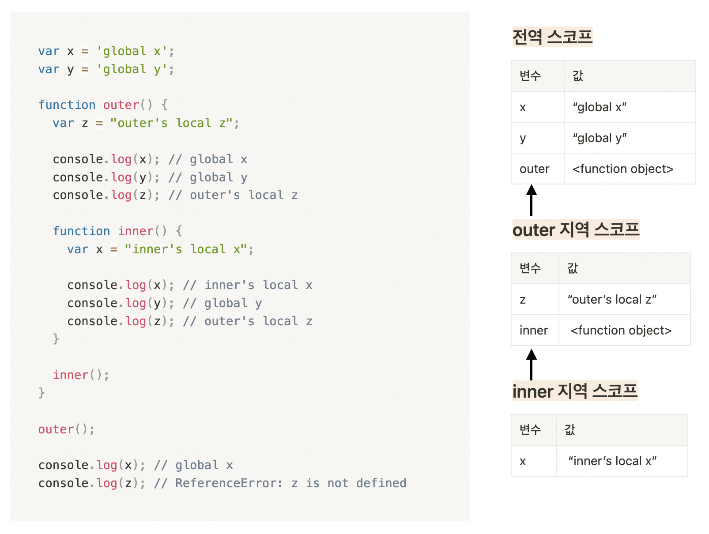

# 13장 스코프

## 1. 스코프란

#### **식별자**가 **유효한 범위**

- 식별자: 변수명, 함수명, 클래스명
- 유효 범위: 다른 코드가 해당 식별자를 **참조할 수 있는** 범위
- 스코프 결정 요인: 식별자가 **선언된** 위치

```js
var var1 = 1; // 코드의 가장 바깥 영역에서 선언한 변수

if (true) {
  var var2 = 2; // 코드 블록 내에서 선언한 변수
  if (true) {
    var var3 = 3; // 중첩된 코드 블록 내에서 선언한 변수
  }
}

function foo() {
  var var4 = 4; // 함수 내에서 선언한 변수

  function bar() {
    var var5 = 5; // 중첩된 함수 내에서 선언한 변수
  }
}

console.log(var1); // 1
console.log(var2); // 2
console.log(var3); // 3
console.log(var4); // ReferenceError: var4 is not defined
console.log(var5); // ReferenceError: var5 is not defined

// var1, var2, var3의 스코프는 전역
// var4는 foo 함수 스코프, var5는 bar 함수 스코프
```

```js
function foo() {
  var var4 = 4;
  bar();

  function bar() {
    console.log(var4);
    var var5 = 5;
  }
}

foo(); // 4
bar(); // ReferenceError: bar의 스코프는 foo 함수 스코프(선언 위치)
```

#### 식별자를 검색할 때 사용하는 규칙

- 자바스크립트 엔진은 스코프를 기준으로 참조할 변수를 결정한다. (식별자 결정)

#### 네임스페이스

- **동일한 스코프 내에서** 식별자는 유일하다.
- 스코프를 통해 식별자의 충돌을 방지하여 같은 이름의 변수를 사용할 수 있게 한다.

```js
var x = 'global';

function foo() {
  var x = 'local';
  console.log(x); // local
}

foo();
console.log(x); // global

// 첫번째 x는 전역 스코프
// 두번째 x는 foo 함수 스코프
```

<br />

## 2. 스코프의 종류

|      |      코드      |   스코프    |   변수    | 참조 범위                          |
| ---- | :------------: | :---------: | :-------: | ---------------------------------- |
| 전역 | 가장 바깥 영역 | 전역 스코프 | 전역 변수 | 어디서든지 참조                    |
| 지역 | 함수 몸체 내부 | 지역 스코프 | 지역 변수 | 선언된 지역과 하위 지역에서만 참조 |

<br />

## 3. 스코프 체인

#### 스코프가 계층적으로 연결된 것

- 함수의 중첩: 함수 몸체 내부에서 함수 정의
  - 중첩 함수: 함수 내부에서 정의된 함수
  - 외부 함수: 중첩 함수를 포함하는 함수
- 함수의 중첩에 의한 스코프의 계층적 구조
  - 중첩 함수의 지역 스코프
  - 외부 함수의 지역 스코프: 중첩 함수의 상위 스코프

#### 스코프 체인을 통해 참조할 변수를 검색

- 변수를 참조하는 코드의 스코프에서 시작하여 상위 스코프 방향으로 이동하며 선언된 변수를 검색한다.

#### 실행 컨텍스트의 렉시컬 환경을 단방향으로 연결한 것

- 렉시컬 환경 (Lexical Environment)
  - 생성 시점: 코드 실행 전
  - 변수 선언 시 key에 변수 식별자 등록
  - 변수 할당 시 value 변경
  - 변수 검색

### 스코프 체인에 의한 변수 검색

</img>

스코프 체인을 따라 변수를 참조하는 코드의 스코프에서 시작해서 상위 스코프 방향으로 이동하며 변수 검색

- inner 지역 스코프에서 변수 검색 ➡️ 상위 스코프인 outer 함수 스코프에서 검색 ➡️ 그 다음 상위 스코프로 이동 ➡️ ... ➡️ 전역 스코프에서 변수 검색

### 스코프 체인에 의한 함수 검색

```js
function foo() {
  console.log('global function foo');
}

function bar() {
  // 중첩 함수
  function foo() {
    console.log('local function foo');
  }

  foo(); // local function foo
}

bar();
```

<br />

## 4. 함수 레벨 스코프

오로지 함수의 코드 블록만을 지역 스코프로 인정하는 경우

- var 키워드로 변수를 선언한 경우 함수 레벨 스코프
- 함수 외에 if, for, while, try/catch 문 등에 의한 코드 블록은 지역 스코프로 인정하지 않는다.
  - let, const 키워드로 변수를 선언한 경우는 이들을 모두 지역 스코프로 인정하는 블록 레벨 스코프

<br />

## 5. 렉시컬 스코프

- 함수의 상위 스코프는 호출 위치에 따라 변경되지 않고 언제나 **정의된 스코프로 고정**된다.
  - 함수의 상위 스코프는 함수가 **정의될 때** 결정되어 변하지 않음
  - 렉시컬 스코프에 의해 상위 스코프가 결정된다.
  - 함수를 **어디서 정의했는지에 따라** 상위 스코프를 결정

```js
var x = 1;

function foo() {
  var x = 10;
  bar();
}

function bar() {
  console.log(x);
}

foo(); // 1
bar(); // 1
```

- bar 함수는 **전역에서 선언되었기 때문에** 상위 스코프는 foo 함수 스코프가 아니라 전역 스코프이다.
  - 따라서 `foo()`의 실행 결과는 10이 아니라 1이다.

### 동적 스코프 🆚 렉시컬 스코프

|                       |           동적 스코프           |           정적 스코프           |
| :-------------------: | :-----------------------------: | :-----------------------------: |
|   스코프 결정 시점    |   동적: 함수가 호출되는 시점    |   정적: 함수가 선언되는 시점    |
| 상위 스코프 결정 기준 |     함수를 **호출한** 위치      |     함수를 **정의한** 위치      |
|                       | 함수를 어디서 호출했는지에 따라 | 함수를 어디서 정의했는지에 따라 |

### 🔎 함수 선언문으로 함수를 정의할 때 일어나는 일

1. 런타임 이전에 함수 객체가 먼저 생성된다.
2. 함수명의 식별자를 암묵적으로 선언하고 (1)에서 생성한 함수 객체를 할당한다.
3. 생성된 함수 객체의 상위 스코프를 기억한다.
   - 이후 함수가 호출될 때마다 기억해둔 상위 스코프를 참조한다.
